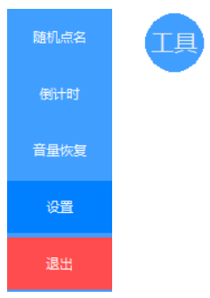
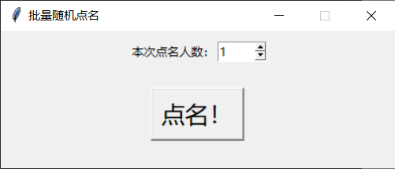
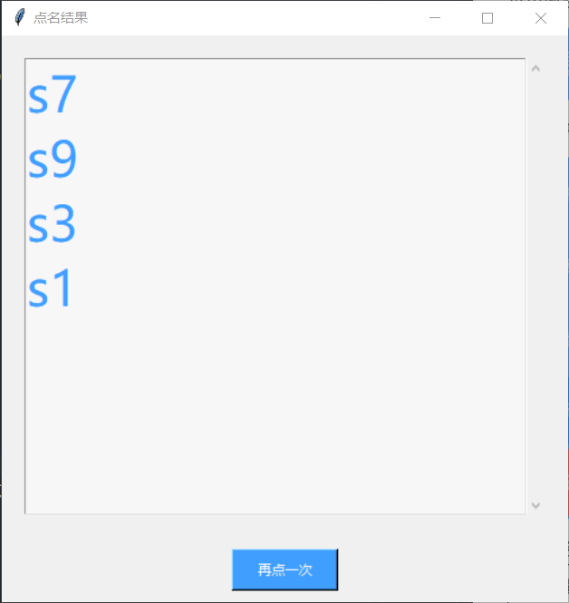
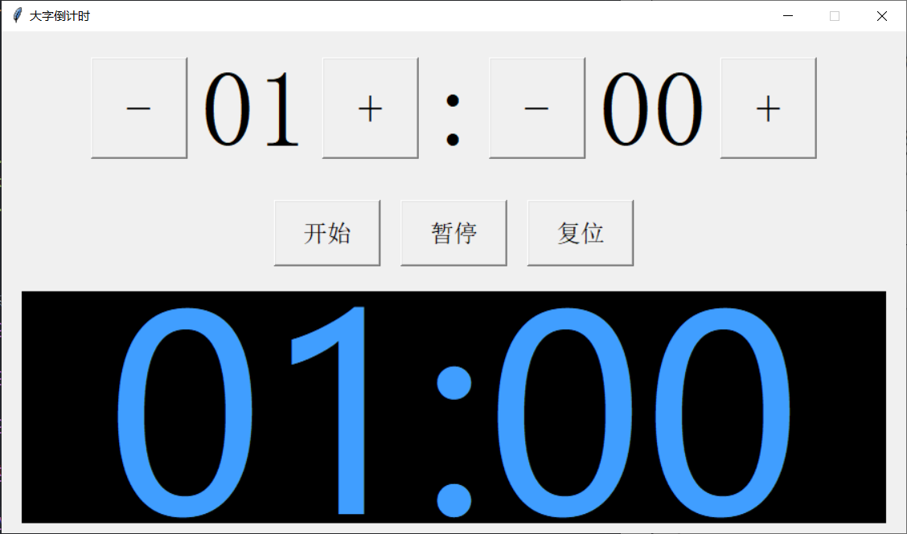
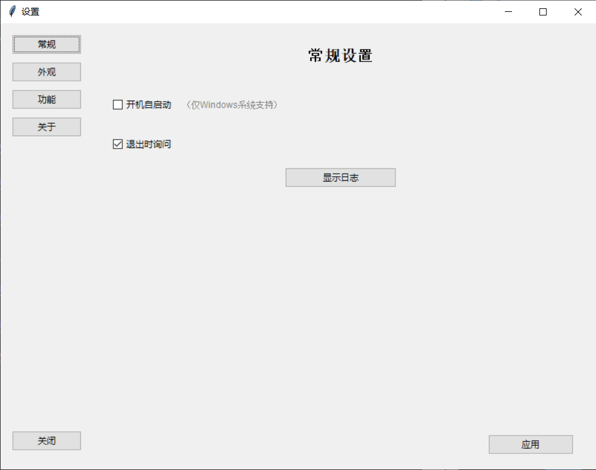
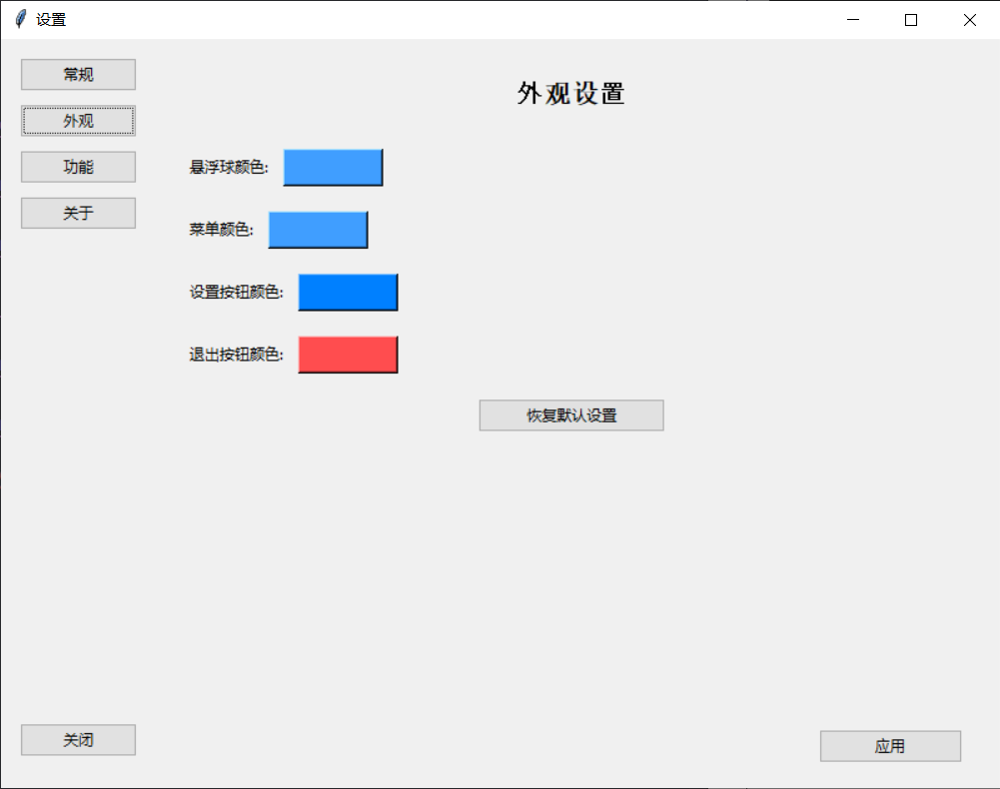
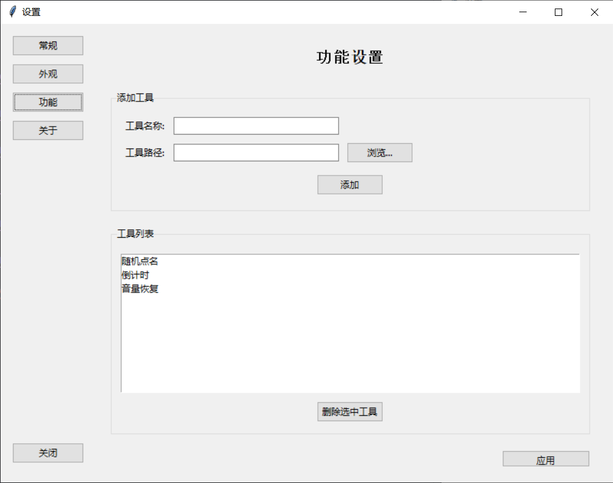
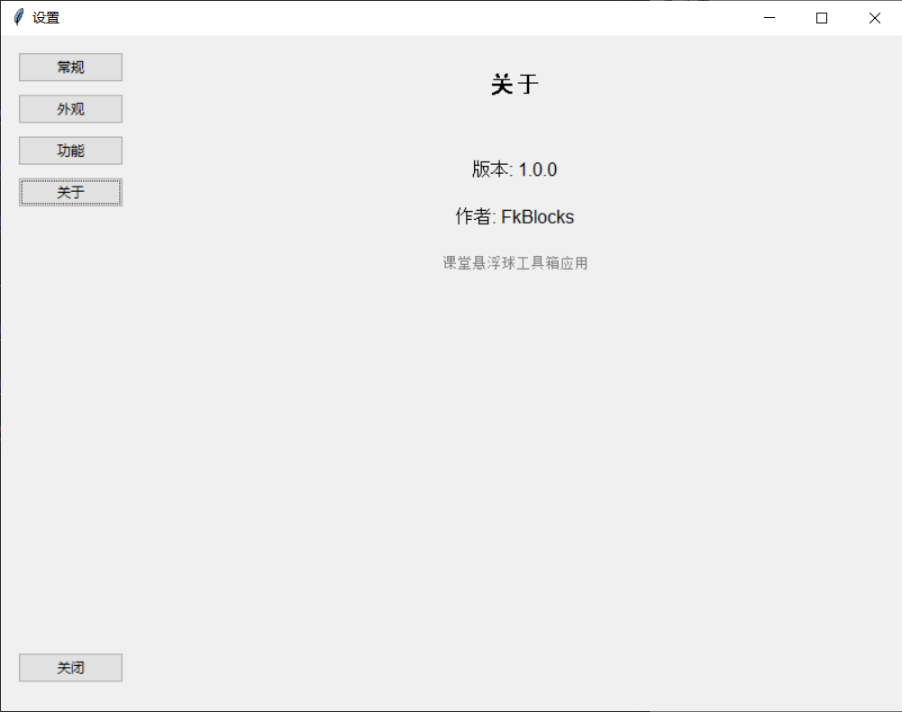

# 课堂工具箱
## 适用于大屏触摸一体机的悬浮球课堂工具箱
## 让课堂和互动无缝衔接
[](LICENSE)

### 功能模块
- 随机点名（全平台）
- 倒计时（全平台）
- 音量恢复（仅支持Windows平台）（防止有同学使用完一体机后忘记回调声音）

### 安装
- 下载并安装`Python 3.8`或以上版本(推荐`Python 3.11`)，然后打开终端输入
```bash
pip install -r requirements.txt
```

### 使用教程
- 双击`main.pyw`文件运行程序，会在屏幕右侧出现一个蓝色悬浮球，可以拖动，点击打开菜单，内置各种工具
- 打开随机点名，设置点名个数，点击`点名`按钮，大屏展示名字
- 倒计时默认1分钟，复位也是1分钟，加减按钮可调节；按下`开始`按钮后开始倒计时，倒计时结束后会有3声滴音提醒
- 设置里可以添加别的工具、改变外观，重启后生效，
- 手动添加工具，打开`tools.json`文件，按照一下格式添加(记得在上一个工具的后面添加逗号，调整菜单顺序只要改变`tools.json`文件工具顺序即可)
tools.json
```json
{
    "工具名称": "工具路径"
}
```
- 大部分错误都会弹窗提示，如果没有弹窗可以打开`log/running.log`查看运行日志

### 注意事项
1. **开机自启动和音量恢复仅支持Windows平台**
2. **一定要确保有**`config/config.json`和`tools.json`文件若没有请自己创建并按照一下输入
config.json
```json
{
    "settings_button_color": "#0080ff",
    "floatball_color": "#409eff",
    "menu_color": "#409eff",
    "exit_button_color": "#ff4d4f",
    "ask_exit": true
}
```
tools.json
```json
{
    "随机点名": "./tools/random-call.py",
    "倒计时": "./tools/count-down.py",
    "音量恢复": "./tools/recovery-voice.py"
}
```
### 本项目会持续更新，欢迎大家在Issues提出意见和建议 *（由于一些技术问题，暂时还没有Release可供下载，目前只能使用源码运行）*

### 常见问题（FAQ）
Q: 双击`main.pyw`什么反应都没有。\
A: 确保安装的是Python 3.8及以上的版本，并用`pip install -r requirements.txt`安装好了依赖库。\

Q: 双击`main.pyw`报错弹窗 & 点设置报错。
A: 确保有`tools.json`和`config/config.json`文件，若没有请手动创建并复制上文给出的两个文件的内容。

Q: 随机点名点不开。\
A: 确保`tools/names.txt`**正确输入了名字并保存**，这个文件为空会报错。\

Q: 点菜单里的工具有时候什么反应都没有。\
A: 如果没有错误弹窗，可以前往`log/running.log`里查看具体原因，也可以反馈在Issues里让我知道并处理。\

Q: 开机自启动失败。\
A: 确保自己是Windows平台，并且在设置里启用了开机自启动。若仍然无效，请按下键盘`Windows徽标键 + R`，在弹出的窗口中输入`shell:startup`，手动将`main.pyw`的**快捷方式**放入打开的文件夹中（注意一定是**快捷方式**而不是把`main.pyw`放进去），重启即可生效。

### 项目截图
菜单收起（普通状态）

菜单展开

随机点名

点名结果

倒计时

设置

